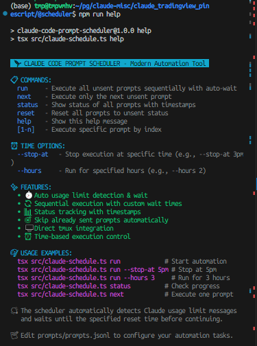
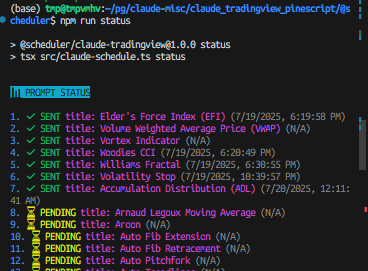
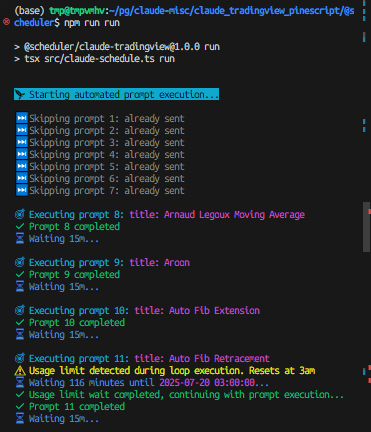

# 🚀 Prompt Scheduler

AIエージェント用プロンプトの使用制限を自動検知する、モダンなTypeScript自動化ツールです。現在Claude Codeに対応しています。

## ✨ 機能

- **🎯 スマート自動化**: カスタマイズ可能な待機時間を使った順次プロンプト実行
- **⏱️ 使用制限検知**: AIエージェント使用制限リセットを自動検知して待機
- **📊 ステータス追跡**: タイムスタンプ付きリアルタイム進捗モニタリング
- **🎨 モダンUI**: カラフルで絵文字豊富なターミナルインターフェース
- **🖥️ Tmux統合**: シームレスなワークフローのための直接tmuxセッション制御
- **🔄 スキップロジック**: 送信済みプロンプトを自動でスキップ
- **⏰ 時間制御**: 特定時刻または継続時間制限での実行停止

## 🛠️ インストール

```bash
# リポジトリをクローン
git clone https://github.com/prompt-scheduler/cli.git
cd cli

# 依存関係をインストール
npm install

# プロンプト設定をセットアップ
cp prompts/prompts.jsonl.sample prompts/prompts.jsonl
# prompts/prompts.jsonlを実際のtmuxセッションパスとプロンプトで編集
```

## 🎨 使用方法

### クイックコマンド (npmスクリプト経由)
```bash
npm run run      # 未送信プロンプトをすべて実行
npm run next     # 次の未送信プロンプトを実行
npm run status   # プロンプトステータスを表示
npm run reset    # すべてのプロンプトを未送信にリセット
npm run help     # ヘルプを表示
```



### ステータス監視
詳細なステータス情報でプロンプト実行の進捗を追跡：



### 高度な時間制御
```bash
# 特定時刻で実行停止
tsx src/claude-schedule.ts run --stop-at 5pm
tsx src/claude-schedule.ts run --stop-at 17:30

# 特定継続時間で実行
tsx src/claude-schedule.ts run --hours 3
tsx src/claude-schedule.ts run --hours 2.5
```

### 直接TypeScript実行
```bash
tsx src/claude-schedule.ts run     # 自動化開始
tsx src/claude-schedule.ts status  # 進捗確認
tsx src/claude-schedule.ts next    # プロンプト1つ実行
tsx src/claude-schedule.ts 3       # プロンプト#3を実行
```

## 📋 コマンド

| コマンド | 説明 |
|---------|-----|
| `run` | 未送信プロンプトを自動待機で順次実行 |
| `run --stop-at TIME` | 特定時刻までプロンプトを実行 (例: 5pm, 17:30) |
| `run --hours N` | N時間プロンプトを実行 |
| `next` | 次の未送信プロンプトのみを実行 |
| `status` | タイムスタンプ付きプロンプトステータスを表示 |
| `reset` | すべてのプロンプトを未送信ステータスにリセット |
| `help` | ヘルプメッセージを表示 |
| `[1-n]` | インデックスで特定プロンプトを実行 |

## 📁 設定

`prompts/prompts.jsonl.sample` を `prompts/prompts.jsonl` にコピーして編集し、自動化タスクを設定してください。各行はプロンプト設定を表します：

```jsonl
{"prompt": "バリデーション付きレスポンシブログインフォームを作成", "tmux_session": "/path/to/your/claude/session", "sent": "false", "sent_timestamp": null, "default_wait": "15m"}
{"prompt": "ログインフォームにエラーハンドリングを追加", "tmux_session": "/path/to/your/claude/session", "sent": "false", "sent_timestamp": null, "default_wait": "10m"}
{"prompt": "モダンなCSSとアニメーションでフォームをスタイリング", "tmux_session": "/path/to/your/claude/session", "sent": "false", "sent_timestamp": null, "default_wait": "5m"}
```

### 設定フィールド

- `prompt`: AIエージェントに送信するプロンプトテキスト
- `tmux_session`: ターゲットtmuxセッションパス
- `sent`: 実行ステータス「true」または「false」
- `sent_timestamp`: 実行タイムスタンプ（自動管理）
- `default_wait`: 実行後の待機時間（「15m」、「1h」、「30s」など）

## 🔧 技術詳細

- **言語**: モダンESモジュールのTypeScript
- **ランタイム**: 直接実行用のtsxを使ったNode.js
- **依存関係**: chalk（色）、dayjs（時間）、tmux（自動化）
- **アーキテクチャ**: 強い型付けを使った関数型プログラミング

## 💡 使用制限の処理

スケジューラーはClaude使用制限メッセージの両方の形式を自動検知します：

1. **「Approaching usage limit · resets at 10pm」**
2. **「Claude usage limit reached. Your limit will reset at 1pm」**

ループ実行中に検知された場合、スケジューラーは：

1. tmuxペインの内容をキャプチャ
2. 正規表現でリセット時刻を解析
3. dayjsで待機時間を計算
4. リセット時刻まで休眠
5. 自動的に実行を継続



**注意**: 既存メッセージからの誤検知を避けるため、初回/単発実行では使用制限検知はスキップされます。

## ⏰ 時間制御機能

### 特定時刻で停止
```bash
# 今日の午後5時（すでに午後5時を過ぎている場合は明日の午後5時）で停止
tsx src/claude-schedule.ts run --stop-at 5pm

# 17:30で停止（24時間形式）
tsx src/claude-schedule.ts run --stop-at 17:30
```

### 特定継続時間で実行
```bash
# ちょうど3時間実行
tsx src/claude-schedule.ts run --hours 3

# 2.5時間実行
tsx src/claude-schedule.ts run --hours 2.5
```

## 🚀 開発

```bash
npm run build    # TypeScriptをJavaScriptにコンパイル
npm run start    # デフォルトコマンド（help）で実行
```

## 📝 使用例

- **コード生成**: 待機期間を設けた複数のコーディングタスクの自動化
- **コンテンツ作成**: レート制限を考慮したコンテンツ生成のスケジューリング
- **データ処理**: インテリジェント待機を使ったリクエストのバッチ処理
- **開発ワークフロー**: 反復的な開発タスクの自動化

## 📄 ライセンス

MIT License - Claude Codeで構築

---

**注意**: このツールはAIエージェント用プロンプトの自動化用に設計されています。現在Claude Codeに対応しています。含まれている `prompts.jsonl` ファイルはデモンストレーション用のサンプルプロンプトです。自動化ニーズに基づいて独自のプロンプトを設定してください。