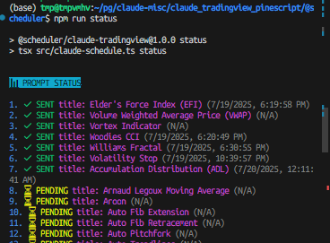

# 🚀 Prompt Scheduler

Modern TypeScript automation tool for scheduling and executing prompts for AI agents with intelligent usage limit detection. Currently supports Claude Code.

## ✨ Features

- **🎯 Smart Automation**: Sequential prompt execution with customizable wait times
- **⏱️ Usage Limit Detection**: Automatically detects and waits for AI agent usage limit resets
- **📊 Status Tracking**: Real-time progress monitoring with timestamps
- **🎨 Modern UI**: Colorful, emoji-rich terminal interface
- **🖥️ Tmux Integration**: Direct tmux session control for seamless workflow
- **🔄 Skip Logic**: Automatically skips already sent prompts
- **⏰ Time Control**: Stop execution at specific times or after duration limits

## 🛠️ Installation

```bash
# Clone the repository
git clone https://github.com/prompt-scheduler/cli.git
cd cli

# Install dependencies
npm install

# Set up your prompts configuration
cp prompts/prompts.jsonl.sample prompts/prompts.jsonl
# Edit prompts/prompts.jsonl with your actual tmux session paths and prompts
```

## 🎨 Usage

### Quick Commands (via npm scripts)
```bash
npm run run      # Execute all unsent prompts
npm run next     # Execute next unsent prompt
npm run status   # Show prompt status
npm run reset    # Reset all prompts to unsent
npm run help     # Show help
```


### Status Monitoring
Track your prompt execution progress with detailed status information:



### Advanced Time Control
```bash
# Stop execution at specific time
tsx src/claude-schedule.ts run --stop-at 5pm
tsx src/claude-schedule.ts run --stop-at 17:30

# Run for specific duration
tsx src/claude-schedule.ts run --hours 3
tsx src/claude-schedule.ts run --hours 2.5
```

### Direct TypeScript Execution
```bash
tsx src/claude-schedule.ts run     # Start automation
tsx src/claude-schedule.ts status  # Check progress  
tsx src/claude-schedule.ts next    # Execute one prompt
tsx src/claude-schedule.ts 3       # Execute prompt #3
```

## 📋 Commands

| Command | Description |
|---------|-------------|
| `run` | Execute all unsent prompts sequentially with auto-wait |
| `run --stop-at TIME` | Execute prompts until specific time (e.g., 5pm, 17:30) |
| `run --hours N` | Execute prompts for N hours |
| `next` | Execute only the next unsent prompt |
| `status` | Show status of all prompts with timestamps |
| `reset` | Reset all prompts to unsent status |
| `help` | Show help message |
| `[1-n]` | Execute specific prompt by index |

## 📁 Configuration

Copy `prompts/prompts.jsonl.sample` to `prompts/prompts.jsonl` and edit it to configure your automation tasks. Each line represents a prompt configuration:

```jsonl
{"prompt": "Create a responsive login form with validation", "tmux_session": "/path/to/your/claude/session", "sent": "false", "sent_timestamp": null, "default_wait": "15m"}
{"prompt": "Add error handling to the login form", "tmux_session": "/path/to/your/claude/session", "sent": "false", "sent_timestamp": null, "default_wait": "10m"}
{"prompt": "Style the form with modern CSS and animations", "tmux_session": "/path/to/your/claude/session", "sent": "false", "sent_timestamp": null, "default_wait": "5m"}
```

### Configuration Fields

- `prompt`: The prompt text to send to the AI agent
- `tmux_session`: Target tmux session path
- `sent`: "true" or "false" execution status
- `sent_timestamp`: Execution timestamp (auto-managed)
- `default_wait`: Wait time after execution ("15m", "1h", "30s", etc.)

## 🔧 Technical Details

- **Language**: TypeScript with modern ES modules
- **Runtime**: Node.js with tsx for direct execution
- **Dependencies**: chalk (colors), dayjs (time), tmux (automation)
- **Architecture**: Functional programming with strong typing

## 💡 Usage Limit Handling

The scheduler automatically detects Claude usage limit message formats:

1. **"Approaching usage limit · resets at 10pm"**
2. **"Claude usage limit reached. Your limit will reset at 1pm"**

When detected during loop execution, the scheduler:

1. Captures tmux pane content
2. Parses reset time using regex
3. Calculates wait duration with dayjs
4. Sleeps until reset time
5. Continues execution automatically


**Note**: Usage limit detection is skipped for initial/single executions to avoid false positives from existing messages.

## ⏰ Time Control Features

### Stop at Specific Time
```bash
# Stop at 5 PM today (or 5 PM tomorrow if it's already past 5 PM)
tsx src/claude-schedule.ts run --stop-at 5pm

# Stop at 17:30 (24-hour format)
tsx src/claude-schedule.ts run --stop-at 17:30
```

### Run for Specific Duration
```bash
# Run for exactly 3 hours
tsx src/claude-schedule.ts run --hours 3

# Run for 2.5 hours
tsx src/claude-schedule.ts run --hours 2.5
```

## 🚀 Development

```bash
npm run build    # Compile TypeScript to JavaScript
npm run start    # Run with default command (help)
```

## 📝 Example Use Cases

- **Code Generation**: Automate multiple coding tasks with wait periods
- **Content Creation**: Schedule content generation with rate limiting
- **Data Processing**: Batch process requests with intelligent waiting
- **Development Workflow**: Automate repetitive development tasks

## 📄 License

MIT License - Built with Claude Code

---

**Note**: This tool is designed for automating AI agent prompts. Currently supports Claude Code. The included `prompts.jsonl` file contains example prompts for demonstration purposes. Configure your own prompts based on your automation needs.